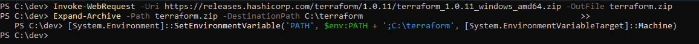
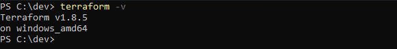

# Criação EC2 com Terraform

## Processo Passo a Passo

### Instalando o Terraform CLI

1. Abra o powershell como admin

2. Navegue até uma pasta de sua escolha

3. Rode o comando para baixar o zip do terraform

```
Invoke-WebRequest -Uri https://releases.hashicorp.com/terraform/1.0.11/terraform_1.0.11_windows_amd64.zip -OutFile terraform.zip
```

4. Rode o comando para descompactar o arquivo zip

```
Expand-Archive -Path terraform.zip -DestinationPath C:\terraform
```

5. Rode o comando para salvar o terraform no path do sistema

```
[System.Environment]::SetEnvironmentVariable('PATH', $env:PATH + ';C:\terraform', [System.EnvironmentVariableTarget]::Machine)
```

6. Verificar se o terraform CLI foi instalado corretamente

```
terraform -v
```

7. Remova o arquivo .zip baixado na etapa 3 (Opcional)

### Instalando AWS CLI

## Imagens do Processo Passo a Passo

### Instalando Terraform CLI



