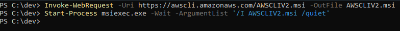
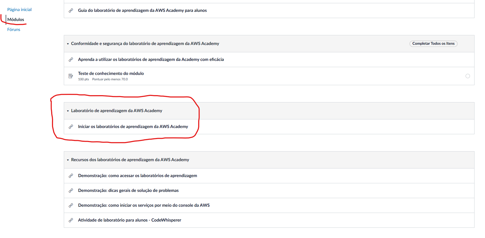
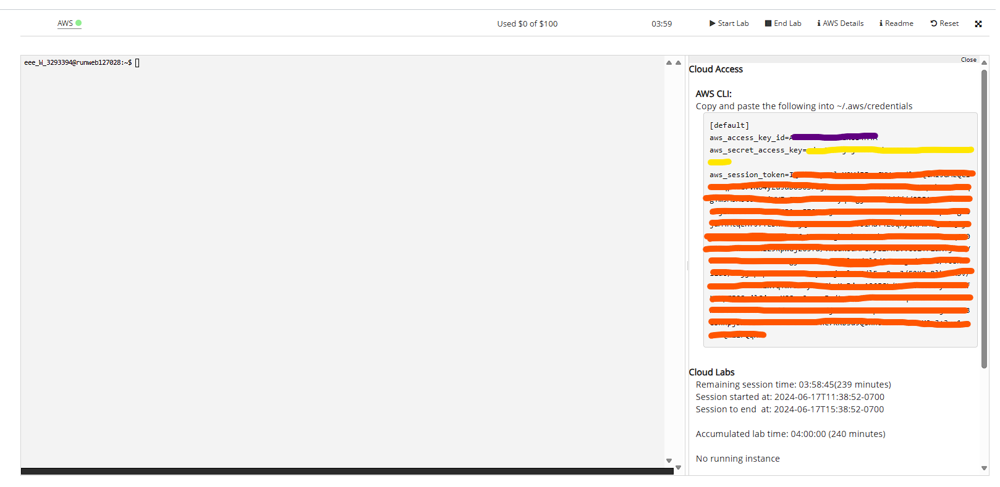

# Criação EC2 com Terraform

## Processo Passo a Passo

### Instalando o Terraform CLI

1. Abra o powershell como admin

2. Navegue até uma pasta de sua escolha

3. Rode o comando para baixar o zip do terraform

```
Invoke-WebRequest -Uri https://releases.hashicorp.com/terraform/1.0.11/terraform_1.0.11_windows_amd64.zip -OutFile terraform.zip
```

4. Rode o comando para descompactar o arquivo zip

```
Expand-Archive -Path terraform.zip -DestinationPath C:\terraform
```

5. Rode o comando para salvar o terraform no path do sistema

```
[System.Environment]::SetEnvironmentVariable('PATH', $env:PATH + ';C:\terraform', [System.EnvironmentVariableTarget]::Machine)
```

6. Rode o comando em um novo terminal para verificar se o terraform CLI foi instalado corretamente

```
terraform -v
```

7. Remova o arquivo .zip baixado na etapa 3 (Opcional)

### Instalando AWS CLI

1. Abra o powershell como admin

2. Rode o comando para baixar o instalador do AWS CLI

```
Invoke-WebRequest -Uri https://awscli.amazonaws.com/AWSCLIV2.msi -OutFile AWSCLIV2.msi
```

3. Rode o comando para instalaro AWS CLI

```
Start-Process msiexec.exe -Wait -ArgumentList '/I AWSCLIV2.msi /quiet'
```

4. Rode o comando em um novo terminal para verificar se a AWS CLI foi instalada corretamente

```
aws --version
```

### Configurando a AWS

1. Abra a AWS Academy no navegador

```
https://awsacademy.instructure.com/
```

2. Abra o learn lab, em:

```
Curso > Módulos > Iniciar os laboratórios de aprendizagem da AWS Academy
```

3. Clique em start lab no canto superior

4. Abra o AWS Details e marque para mostrar o AWS CLI

5. Rode o comando para configurar as credenciais da aws

```
aws configure
```

6. Preencha cada uma das infos solicitadas pela etapa anterior com as credenciais do AWS Academy

```

```

## Imagens do Processo Passo a Passo

### Instalando Terraform CLI


### Instalando AWS CLI




### Configurando a AWS




