# Imagens do Processo Passo a Passo

## Instalando Terraform CLI

## Instalando AWS CLI

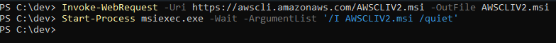

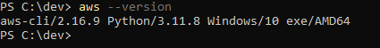

## Configurando a AWS

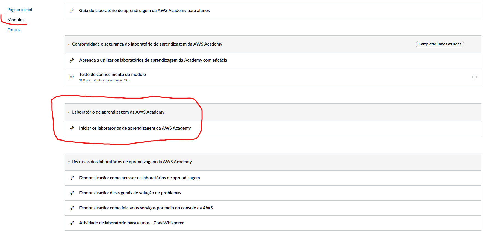

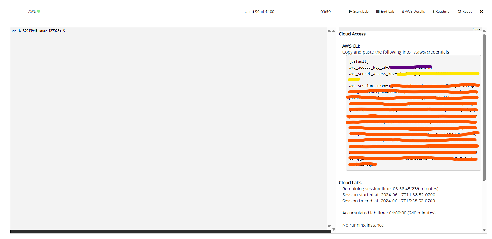

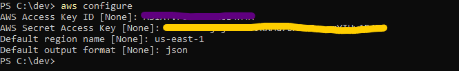

## Criando a EC2 com Terraform

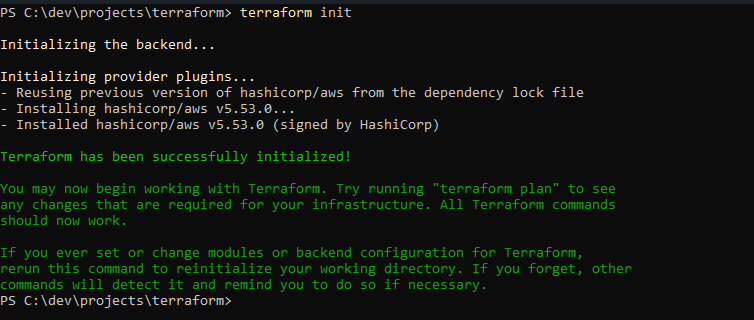

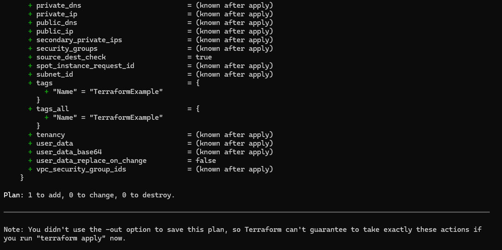

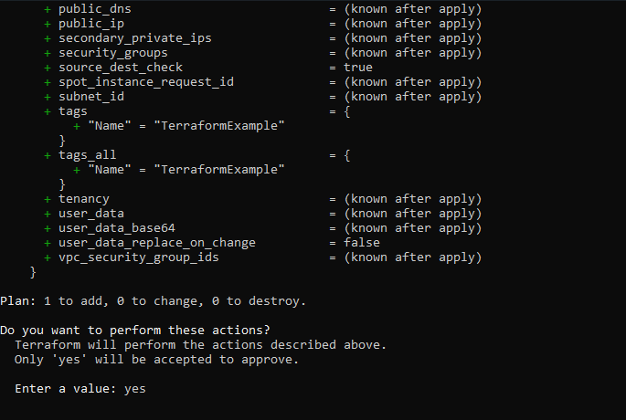

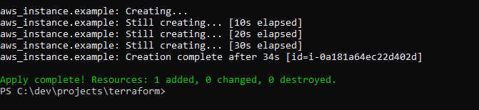

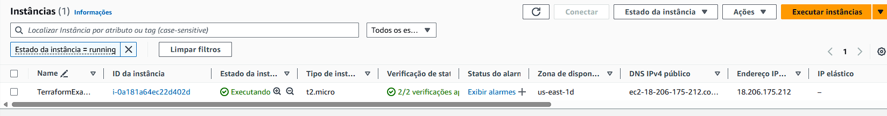

## Removendo as infras criadas

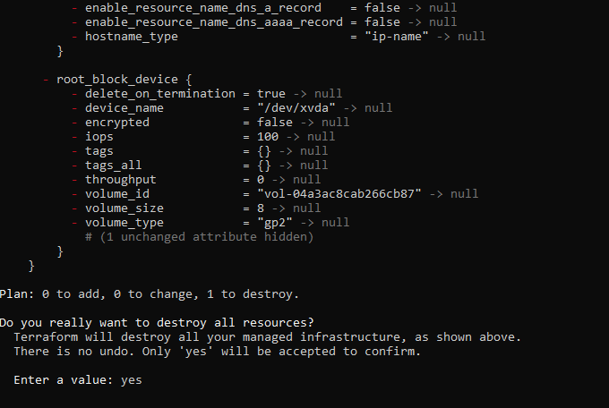

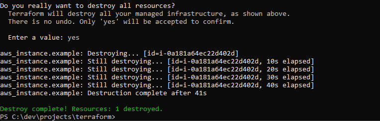

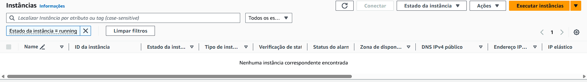
